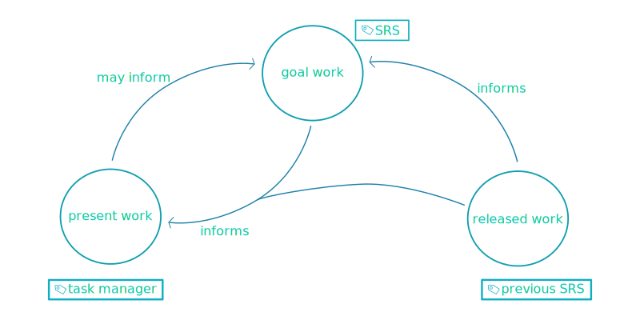

# SRSGem

## What is it?

  - a tool which translates [Markdown](https://en.wikipedia.org/wiki/Markdown) and [PlantUML](https://plantuml.com/) into a clean, styled, robust Software Requirements Specification (SRS) document which can be opened in any modern web browser

## Prerequisites

  - Install [PlantUML](https://plantuml.com/starting) on your machine.
    + (Look into the package manager for your OS.)

## Installation

  1. `gem install srsgem`

## Creating a New SRS

  1. Run `srsgem init MyNewSRS`.

## Quick Start

After installation, if you just want to see SRSGem build an SRS with placeholder content, then:

  1. `cd` into directory `MyNewSRS`.
  2. Run `srsgem build`.
  3. Open `MyNewSRS/output/srs.html` in your favorite browser to view your SRS.

## Getting Started

  1. `cd` into directory `MyNewSRS`.
  2. Open `title.yml` with your favorite editor and replace the placeholder content.
  3. Open the markdown (`.md`) files and fill them out.
  4. Open the PlantUML (`.puml`) files and fill them out.
  5. Create additional markdown or PlantUML files.
    
  - Note: transpiler will include content from `md` and `puml` files in lexicographic order from within your SRSGem project directory.

  6. Run `srsgem build`.
  7. Open `MyNewSRS/output/srs.html` in your favorite browser to view your SRS. 

## What does it do?

  - Converts markdown and PlantUML into an SRS in HTML format.
    + auto-numbers sections and sub-sections based on header levels in markdown
    + auto-generates a hyperlinked table of contents
    + auto-generates sections for diagrams written using PlantUML syntax, then populates those sections with `svg` exports from the corresponding `puml` files
    + styles the document using `srs.css`

## Why SRSGem?

  - because traditional SRS documents are bulky and require a specific word processor or other proprietary application
  - because as word processor documents travel between different systems, styling gets lost
  - because extracting just the right information from a ticketing or tracking system is painful
  - because stakeholders don't want to login to a tracking or wiki application to have to read about an application
  - because most information you supply to SRSGem should be in plain text and therefore can (and should) be version controlled
  - because output flexibility is way better than popular tracking or wiki application output
  - because scrolling up and down an HTML page (the format of the output SRS document) in a browser is faster
  - because navigating one HTML page using anchor tags is faster than navigating a slow, clunky heavy web application
  - because wikis and trackers are easily broken and difficult to fix
  - because people who write documentation for coders should know how to code a little too
  - because [FOSS](https://en.wikipedia.org/wiki/Free_and_open-source_software) is better

## What is SRSGem not?

  - NOT a task tracking system
  - NOT a bug tracking system
  - NOT a web application
  - NOT a proprietary document format specification
  - NOT a source code-to-documentation transpiler

## Project

### SRS

(*Yes, an SRS for the program that makes SRSs.*)

  - *Coming soon!*

### Task Management

  - [SRSGem Tickets Repository](https://github.com/jmbarnardgh/srsgem_tickets)

## Q&A

  - **Do I need to know markdown to supply information to the SRS?**
    + **ANSWER:** Markdown is preferred, but HTML is also recognized by the Pandoc compiler upon which SRSGem depends. So, theoretically, you could write the entire SRS in HTML... but that would defeat the purpose of keeping things concise in markdown files. Moreover, the output file *is* HTML anyway.
  - **Does SRSGem export to PDF?**
    + **ANSWER:** You are better off exporting to PDF from HTML using your favorite browser. But, we may consider adding this as a future feature.
  - **Do I need to manually number sections and subsections of the SRS?**
    + **ANSWER:** No. SRSGem auto-numbers sections and subsections based on header levels in the markdown you provide.
  - **Will SRSGem compile additional markdown files in `./` if I create them?**
    + **ANSWER:** Yes. They will be compiled in lexicographic order.
  - **Do I need to know PlantUML syntax to supply diagrams to the SRS?**
    + **ANSWER:** Well, not exactly. You could cheat and simply use markdown links to images you create. This is kind of a hack and may not yield the best results. The reason for keeping the 'source' of your diagrams in plain text (`puml`) is to lighten the load on version control systems. SRSGem converts `puml` into `svg`. Both `puml` and `svg` are plain text. This is better for version control.
  - **Do I need to manually export `png` or `jpg` files from PlantUML source for the SRS to include the diagrams?**
    + **ANSWER:** No. SRSGem will auto-convert your `puml` PlantUML files to `svg` files and include them in auto-generated diagram sections of the SRS output.
  - **Do I need an application server to open an HTML SRS file?**
    + **ANSWER:** No. The output SRS file is simple HTML and requires no server-side component to open and view. Simply open `output/srs.html` with your favorite browser. Alternatively, you could run `srsgem opensrs` within your SRS Project Directory.
  - **Do I need to be online to open a generated SRS?**
    + **ANSWER:** No. However, if you want to implement some sort of cross origin resource sharing (CORS) for content of your SRS, that is totally on you and up to you. 
  - **Can I supply my own CSS?**
    + **ANSWER:** Yes. After you have initialized a directory using SRSGem, simply edit `srs.css`.
  - **Do I need to supply an anchor name for markdown headers?**
    + **ANSWER:** No. The Pandoc compiler will supply HTML anchor names for sections and subsections (to a certain level) corresponding to headers in your markdown files.
  
## Philosophy

### Why have an SRS?

In the morass of development work, it can be easy to get lost in a sea of tasks. What **are** we working on? What **can** we work on? What **should** we work on? What **did** we work on? What has been **done**?

  - When discussing a released version of a system, an SRS describes what went into that release in a clear, concise, navigable fashion.
  - When discussing an in-development version of a system, an SRS helps distinguish *goals* from *present* and *past* work.

It's not that you can't update an SRS. Oftentimes, an SRS is updated because technical hurdles arise during development, or maybe a change is introduced due to some alteration of business logic. Nevertheless, some amount of rigidity is necessary when specifying a goal or a set of goals.

Having an SRS in large part is having an attitude of *we are going to get something done, so let's lock in on it and go for it.*

An established SRS for released work is invaluable for team dynamism. Onboarding new developers, testers, etc. and/or conducting hand-off sessions are much easier with clear, organized, focussed information about a stable release of the system.

The following diagram illustrates how one might think about an SRS. If we were to tag *past*, *present* and *future* work with different informational artifacts, this is how it might look...

The current SRS is the tip of the spear, guiding the team toward a goal. It should remain fairly rigid, but it can be adjusted as needed. You can think of it as defining the next release candidate.

Present work (tasks) are largely informed by the goals (specifications) in the SRS. A task manager is best suited for handling this information.

Specifications set forth in the current SRS are informed in part by the previous SRS - inasmuch as it is helpful to know what has already been done so as not to 'reinvent the wheel.'

### Meta-Information and its Meta-Goal

Not only should an SRS contain 'specifications,' but it should also contain information regarding *why* certain specifications were chosen. This allows stakeholders to more readily ascent to specified goals without wasting precious time debating why certain things have to be a certain way.

Writing good meta-information helps to achieve a meta-goal - a goal for the goals, as it were. The goal of meta-information in an SRS is to help rigidify the goals for the system. Being able to easily navigate to explanatory information in an SRS saves copious amounts of time in the way of stakeholder discussions/meetings.

  - example specification and its meta-information:
    + a *technical specification* states that the application must function offline
    + related meta-information (*technical constraint*) states that physical location of most users using the application is a place where WiFi, Ethernet, cable, etc. forms of connectivity are poor or do not exist